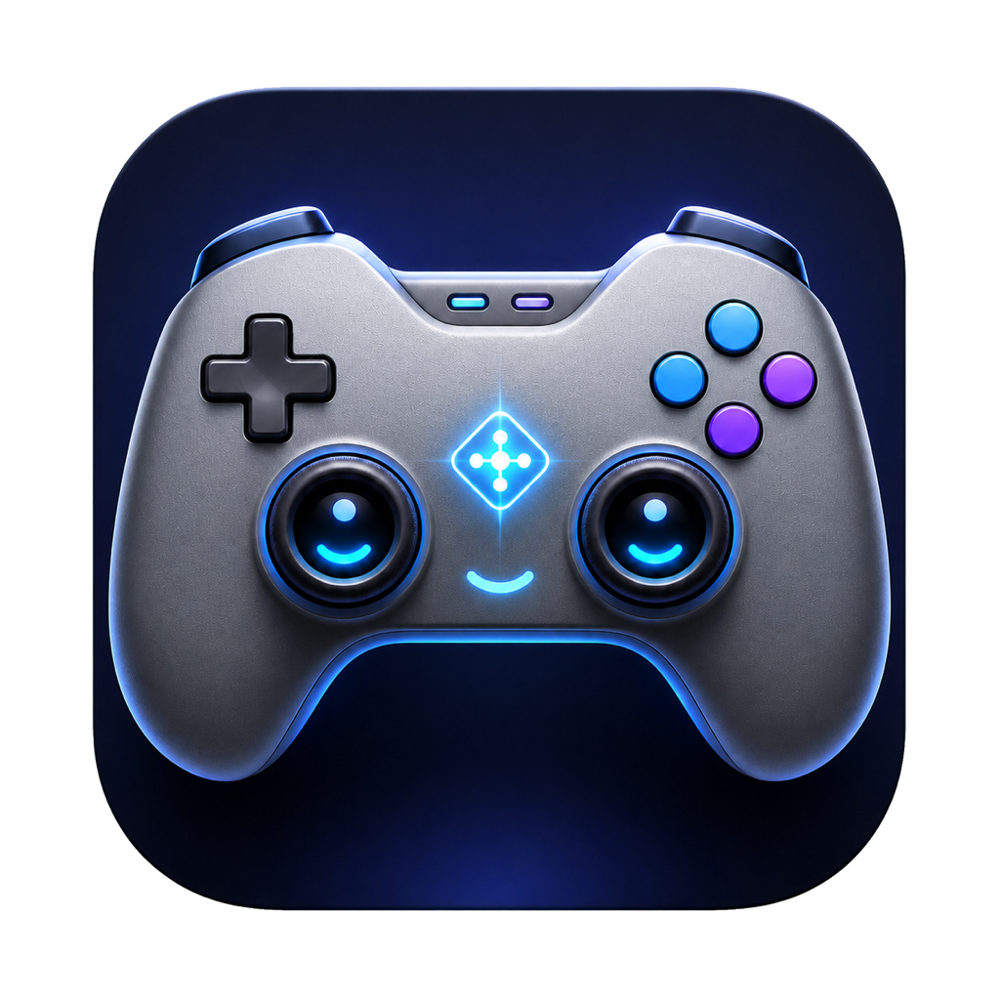

# Vibe Controller

<p align="center">
  
</p>

Vibe Controller is a native macOS app that turns an Xbox-compatible game controller into a desktop input device. Use the analog sticks as primary and precision cursors, map controller buttons to mouse actions or keyboard shortcuts, scroll and switch Spaces with the D-pad, and move seamlessly between nearby Macs with macOS Universal Control.

The app includes a live Xbox-style controller map, per-control remapping, adjustable cursor response, importable and exportable JSON profiles, input diagnostics, native Universal Control handoff, and an experimental network companion mode for Macs that cannot use Universal Control.

## Requirements

- macOS 14 or newer
- An Xbox-compatible controller connected over Bluetooth or USB
- Accessibility permission so Vibe Controller can move the pointer and send input
- Swift 6.2 or a compatible Xcode toolchain when building from source
- Universal Control configured in macOS when controlling another Mac natively
- The one-time **Virtual Hardware Support** install on the lead Mac for seamless Universal Control handoff
- Local-network permission on both Macs only when using the optional companion mode

## Build and run

Clone the repository and run the Swift package directly:

```sh
git clone https://github.com/ggaabe/vibe-controller.git
cd vibe-controller
swift build
swift test
swift run VibeController
```

To build a signed `.app` bundle instead:

```sh
VIBE_CONTROLLER_SIGNING_IDENTITY="Apple Development: Your Name (TEAMID)" ./Scripts/package_app.sh
open "dist/Vibe Controller.app"
```

`package_app.sh` now performs the complete build: it compiles the app and bridge, downloads and verifies the pinned driver when needed, creates Virtual Hardware Support, embeds that installer and the third-party notice, and signs the app. It refuses to produce an app without the driver package. Both Vibe executables must use the same signing identity; set `VIBE_CONTROLLER_SIGNING_IDENTITY` to the exact value shown by `security find-identity -v -p codesigning`.

## First-run setup

1. Connect the controller over Bluetooth or USB and open Vibe Controller.
2. The app checks setup automatically and requests Accessibility. Approve Vibe Controller in **System Settings → Privacy & Security → Accessibility**.
3. The bundled **Virtual Hardware Support** installer opens automatically. Approve its one-time administrator prompt.
4. Vibe Controller then requests Driver Extension activation and opens **System Settings → General → Login Items & Extensions**. Open the Karabiner detail and enable its Driver Extension.
5. Return to Vibe Controller. It polls each gate and advances on its own; the Cross-Mac card finishes at **Cross-Mac input is ready**.
6. Confirm that the header reports the controller as connected, then move the sticks and press buttons while watching the live diagnostics and blue controller-map highlights.
7. Click any control on the map to change its action or shortcut, and adjust cursor response in the Cursor panel as desired.

The app requests each missing step only once per launch so it does not trap users in repeated system dialogs. **Run Setup Again**, **Open Installer**, and **Open Driver Settings** remain available when someone cancels a prompt. macOS intentionally requires a person to approve Accessibility, the administrator install, and the Driver Extension; the app can detect and open those gates but cannot silently bypass Touch ID or the account password.

Profiles are saved locally at `~/Library/Application Support/Vibe Controller/profiles.json`. Use **Import Profile** and **Export Profile** to move an individual profile between Macs.

## Universal Control between Macs

Vibe Controller sends relative motion, mouse buttons, scrolling, and keyboard shortcuts through a DriverKit virtual mouse and keyboard. macOS recognizes them as hardware devices, so Universal Control keeps forwarding their reports after the pointer crosses onto another Mac. Cursor-warp and synthetic-event APIs can reach Universal Control's edge, but macOS stops routing those events after handoff; the virtual devices are what make continued motion possible.

Only the lead, controller-connected Mac needs Vibe Controller for this mode. The second Mac does not need the app, the companion receiver, or local-network permission.

1. Set up Universal Control on both Macs using [Apple's instructions](https://support.apple.com/en-us/102459). The Macs should already let the lead Mac's trackpad move through the chosen display edge.
2. Complete the automatic three-step setup shown in Vibe Controller. This installs the open-source [Karabiner DriverKit VirtualHIDDevice](https://github.com/pqrs-org/Karabiner-DriverKit-VirtualHIDDevice) and Vibe Controller's signed bridge, then requests the required macOS approvals.
3. Wait for the Cross-Mac card to say **Cross-Mac input is ready**.
4. Connect the Xbox controller to the lead Mac. USB is recommended: supported Microsoft Xbox USB devices use a direct HID reader that remains active while Universal Control owns the pointer on the second Mac.
5. Leave **Cross-Mac Control → Mode** set to **Native Universal Control**. Move the primary stick through the same left or right edge used by Universal Control. Keep holding the stick and the pointer will continue across the second Mac.
6. Click, scroll, dictate, capture a screenshot, or start an LT drag after the pointer arrives on the second Mac. Those mapped actions follow the Universal Control pointer target.
7. Push back through the corresponding edge to return to the lead Mac.

The installed bridge runs with elevated privileges because the virtual-HID daemon accepts only root clients. It accepts commands only through a pipe inherited from a valid `com.vibe-controller.app` process signed by the same development team; unrelated local processes are rejected. The older IOHIDSystem route remains available as a local-pointer fallback but is not presented as successful cross-Mac control.

The app falls back to Apple's Game Controller framework for Bluetooth controllers and non-Microsoft gamepads. Direct USB input is preferred for the cleanest cross-Mac handoff because it is read on the lead Mac independently of Universal Control's active pointer target.

### What Virtual Hardware Support installs

Yes—the HID component is required. Universal Control stops forwarding ordinary synthetic cursor events after the handoff, while a virtual hardware mouse continues like a trackpad. The bundled support package contains:

- The unmodified, signed, and Apple-notarized **Karabiner-DriverKit-VirtualHIDDevice 8.2.0** package, pinned by SHA-256.
- Vibe Controller's small signed bridge, installed setuid-root because the Karabiner daemon accepts only root clients. The bridge rejects callers unless its parent is the signed `com.vibe-controller.app` from the same Apple team.
- No software for the second Mac; all support lives on the lead Mac.

`THIRD_PARTY_NOTICES.md` is embedded in every packaged app. The source repository does not commit the third-party binary: the packaging script downloads it from the tagged upstream release, verifies its exact checksum and Apple notarization, and then embeds it in the app's Resources directory.

For a public downloadable release, sign the app and bridge with a Developer ID Application identity, provide `VIBE_CONTROLLER_INSTALLER_SIGNING_IDENTITY="Developer ID Installer: …"`, and notarize the finished distribution. Local source builds can use an Apple Development identity and an unsigned outer installer, but macOS will still show the expected administrator approval.

## Gabe's Defaults

Fresh installs start with the bundled **Gabe's Defaults** profile:

| Control | Default action | Notes |
| --- | --- | --- |
| Left stick | Primary cursor | Approximately 2228 px/s |
| Right stick | Precision cursor | Approximately 566 px/s |
| LT | Left mouse hold | Hold while moving the cursor to drag |
| LB | Escape | Sends `Esc` |
| RT | Voice dictation | Holds the `Fn` key; configure macOS Dictation to use the Fn shortcut if needed |
| RB | Right click | Standard secondary click |
| A | Left click | Standard primary click |
| B | Area screenshot to clipboard | Sends `⌃⇧⌘4`; drag over an area, then paste the screenshot |
| X | TextSniper OCR capture | Sends `⇧⌘2`; drag over text to OCR it into the clipboard |
| Y | Paste | Sends `⌘V` |
| D-pad up/down | Scroll | Repeats while held |
| D-pad left/right | Switch Space | Moves one macOS Space left or right |
| L3 | Return | Sends the Return key |
| R3 | Delete | Sends backward Delete |
| View | Unassigned shortcut | Ready for a custom keyboard shortcut |
| Menu / Home | No action | Available for custom mappings |

The cursor profile also enables acceleration with a `0.12` dead zone, `1.8` response curve, `0.5` smoothing, and neutral axis multipliers.

### Recommended OCR companion

The X-button workflow expects [TextSniper](https://textsniper.app/) or an equivalent screen-OCR utility listening for `⇧⌘2`. TextSniper lets you drag over any visible text, recognizes the selection, and puts the editable OCR result directly on the clipboard. It is a separate paid app and is recommended if you want the default OCR workflow; you can instead install another OCR tool and remap X to its capture shortcut.

### Voice dictation and area screenshots

- **Voice dictation:** RT sends and holds `Fn`. Enable Dictation in macOS Keyboard settings and select an Fn-based Dictation shortcut, or remap RT to the shortcut you prefer.
- **Area-select screenshot:** B sends `⌃⇧⌘4`, macOS's selection screenshot shortcut with Control added so the result goes to the clipboard instead of a file. Drag the area and paste with Y or `⌘V`.
- **OCR area selection:** X sends `⇧⌘2`, TextSniper's standard Capture Text shortcut. Drag the text area; the OCR result is copied automatically, and Y pastes it.

## Remapping controls

Click a button, trigger, stick-click control, or D-pad direction on the controller map. Choose an action type and trigger behavior, then save it. Supported actions include:

- Keyboard shortcuts
- Left, right, middle, and double click
- Left-button drag
- Vertical and horizontal scrolling
- Space switching
- Primary/precision cursor-speed toggling

Stick roles are configured separately by clicking either stick. Shortcut assignments and cursor settings are persisted automatically.

## Optional two-Mac companion mode

Companion mode can forward cursor motion, clicks, scrolling, shortcuts, and Space-switch actions over the local network. It is an advanced fallback for Macs that cannot use native Universal Control; most two-Mac setups should use the Universal Control instructions above.

1. Run Vibe Controller on both Macs.
2. Set one Mac to **Receiver Mac**.
3. Set the controller-connected Mac to **Controller Mac**.
4. Choose the handoff edge and receiver, then connect.
5. Push the cursor through that screen edge to hand control to the receiver. Move through the corresponding return edge to come back.

Both Macs need Accessibility and local-network permission. The Companion panel shows peer/build metadata and handoff diagnostics; **Force Handoff** and **Return Local** are available for testing.

## Utilities and experiments

- `ControllerProbe` prints controller input for low-level diagnostics.
- `VirtualHIDExperiment` and `Experiments/VirtualHID` contain exploratory input-routing work.
- `VibeVirtualHIDBridge` is the minimal privileged bridge used by the DriverKit virtual mouse and keyboard.
- `Scripts/check_virtual_hid_provisioning.sh` checks the local signing and provisioning prerequisites for that experiment.
- `Scripts/fetch_virtual_hid_driver.sh` downloads and verifies the pinned, notarized third-party driver package.
- `Scripts/package_virtual_hid_support.sh` creates the combined one-time support installer.

## Development

Run the complete test suite with:

```sh
swift test
```

The app is implemented in SwiftUI and uses Apple's GameController, CoreGraphics, ApplicationServices, and Network frameworks.
